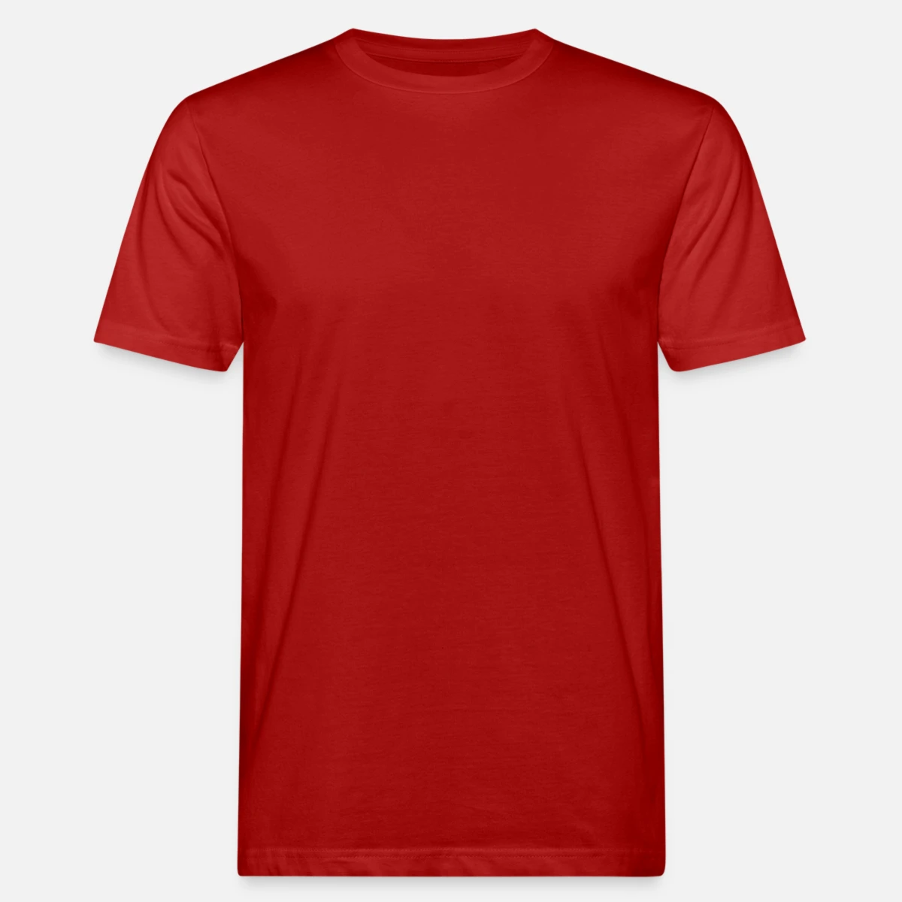
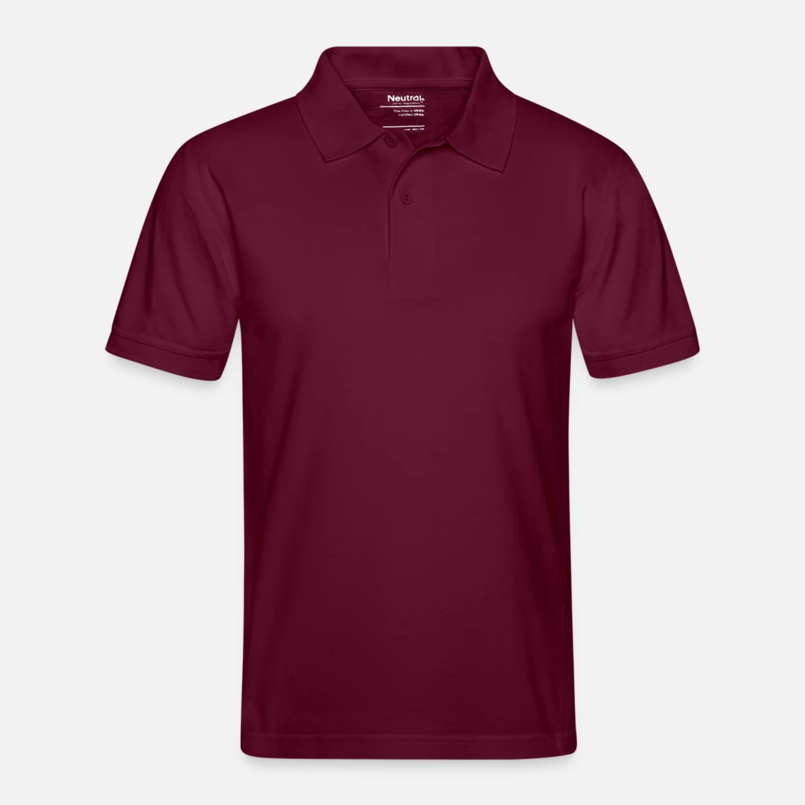

# T-Shirts

## Männer

### Einzelbestellungen möglich

#### [Männer Bio-T-Shirt](https://www.spreadshirt.de/gestalten/detail/m%C3%A4nner-bio-t-shirt-PT635?appearance=2)

* dunkelrot 

* 17,99 € (Ab 6 Artikel - 10% Rabatt)
* Klassischer Schnitt mit hohem Rundhalsausschnitt
* Strapazierfähige Stoffqualität: 155 g/m²
* Material: 100% Baumwolle aus biologischem Anbau

| Größe | A (cm) | B (cm) | C (cm) |
|-------|--------|--------|--------|
| M     | 72.0   | 53.0   | 22.0   |
| L     | 74.0   | 56.0   | 23.5   |
| XL    | 76.0   | 60.0   | 25.0   |
| XXL   | 78.0   | 64.0   | 26.5   |

#### [Männer Premium Bio T-Shirt](https://www.spreadshirt.de/gestalten/detail/m%C3%A4nner-premium-bio-t-shirt-PT1352?appearance=231)

* grau meliert 

* 17,99 € (Ab 6 Artikel - 10% Rabatt)
* Unsere Empfehlung! Top-Qualität und beste Druckergebnisse in allen Druckarten
* Einheitliche Farben in allen Männer- und Frauengrößen
* Fair und nachhaltig produziert
* Strapazierfähige Stoffqualität: 150 g/m²
* Material: 100% Baumwolle (aus biologischem Anbau) 

| Größe | A (cm) | B (cm) | C (cm) |
|-------|--------|--------|--------|
| S     | 71.0   | 45.5   | 20.3   |
| M     | 73.5   | 51.0   | 21.0   |
| L     | 76.0   | 56.0   | 22.8   |
| XL    | 78.5   | 61.0   | 23.5   |
| XXL   | 81.0   | 66.0   | 24.0   |
| 3XL   | 83.5   | 71.0   | 26.0   |
| 4XL   | 86.0   | 76.0   | 26.7   |
| 5XL   | 88.5   | 81.0   | 27.9   |

#### [Männer Bio-T-Shirt mit gerollten Ärmeln](https://www.spreadshirt.de/gestalten/detail/m%C3%A4nner-bio-t-shirt-mit-gerollten-%C3%A4rmeln-PT1570?appearance=22)

* bordeaux 

* ~~19,99 €~~ 16,99 € (15% Rabatt für 20 Artikel)
* Männer T-Shirt mit Rundhalsausschnitt
* Kurze Ärmel mit gerolltem Aufschlag
* Nackenband innen
* Stoffdichte: 155 g/m²
* Material: 100% Baumwolle (aus biologischem Anbau)
* Marke: Neutral 

| Größe | A (cm) | B (cm) |
|-------|--------|--------|
| S     | 68.0   | 48.0   |
| M     | 71.0   | 51.0   |
| L     | 74.0   | 54.0   |
| XL    | 77.0   | 57.0   |
| XXL   | 80.0   | 60.0   |
| 3XL   | 83.0   | 63.0   |

## Frauen

### Einzelbestellungen möglich

#### [Frauen Premium Bio T-Shirt](https://www.spreadshirt.de/gestalten/detail/frauen-premium-bio-t-shirt-PT1351?appearance=231)

* grau-meliert 

* 17,99 € (Ab 6 Artikel - 10% Rabatt)
* Unsere Empfehlung! Top-Qualität und beste Druckergebnisse in allen Druckarten
* Einheitliche Farben in allen Männer- und Frauengrößen
* Fair und nachhaltig produziert
* Strapazierfähige Stoffqualität: 150g/m²
* Material: 100% Baumwolle (aus biologischem Anbau)

| Größe | A (cm) | B (cm) | C (cm) |
|-------|--------|--------|--------|
| S     | 65.0   | 44.5   | 14.6   |
| M     | 67.0   | 47.5   | 15.2   |
| L     | 69.0   | 51.0   | 15.8   |
| XL    | 71.0   | 55.0   | 16.5   |
| XXL   | 73.0   | 58.0   | 17.0   |
| 3XL   | 75.0   | 61.0   | 17.7   |

#### [Frauen Bio-T-Shirt](https://www.spreadshirt.de/gestalten/detail/frauen-bio-t-shirt-PT461?appearance=231)

* grau-meliert 

* 17,99 € (Ab 6 Artikel - 10% Rabatt)
* Fällt klein aus: bitte eine Nummer größer bestellen
* Körpernaher Schnitt mit hohem Rundhalsausschnitt
* Strapazierfähige Stoffqualität: 145g/m²
* Material: 100% Baumwolle aus biologischem Anbau

| Größe | A (cm) | B (cm) | C (cm) |
|-------|--------|--------|--------|
| S     | 65.0   | 40.0   | 15.5   |
| M     | 66.0   | 43.0   | 16.0   |
| L     | 67.0   | 45.5   | 17.0   |
| XL    | 68.0   | 48.0   | 17.5   |

#### [Stanley/Stella Frauen Bio-T-Shirt mit V-Ausschnitt](https://www.spreadshirt.de/gestalten/detail/stanley-stella-frauen-bio-t-shirt-mit-v-ausschnitt-PT857?appearance=231)

* grau-meliert 

* 18,99 € (Ab 6 Artikel - 10% Rabatt)
* Marke: Stanley/Stella
* körpernaher Schnitt
* angenehm leichte Stoffqualität: 120g/m²
* Material: 100% Baumwolle aus ökologischem Anbau

| Größe | A (cm) | B (cm) | C (cm) |
|-------|--------|--------|--------|
| S     | 64.0   | 44.5   | 15.0   |
| M     | 66.0   | 47.5   | 16.0   |
| L     | 68.0   | 50.5   | 16.0   |
| XL    | 69.0   | 53.5   | 17.0   |
| XXL   | 69.0   | 56.5   | 18.0   |

#### [Stanley/Stella Frauen Bio-T-Shirt](https://www.spreadshirt.de/gestalten/detail/stanley-stella-frauen-bio-t-shirt-PT1264?appearance=741)

* burgunderrot 

* 15,99 € (Ab 6 Artikel - 10% Rabatt)
* Figur betonender, leicht taillierter Schnitt 
* Weiter Rundhalsausschnitt
* Etwas länger, so dass beim Einstecken in Hose oder Rock nichts herausrutscht
* Weiche, anschmiegsame Stoffqualität: 155 g/m²
* 85% Baumwolle (biologisch erzeugt) und 15% Polyester (reycelt) 

| Größe | A (cm) | B (cm) | C (cm) |
|-------|--------|--------|--------|
| S     | 64.0   | 44.5   | 16.0   |
| M     | 66.0   | 47.5   | 17.0   |
| L     | 66.0   | 50.5   | 17.0   |
| XL    | 68.0   | 53.5   | 18.0   |
| XXL   | 69.0   | 56.5   | 18.0   |

## Unisex

### Mindestbestellmenge 20

#### [Stanley/Stella Unisex Bio-T-Shirt](https://www.spreadshirt.de/gestalten/detail/stanley-stella-unisex-bio-t-shirt-PT1580?appearance=741)

* anthrazit 
* burgunderrot 
* dunkelgrau meliert 

* ~~17,99 €~~ 15,29 € (15% Rabatt für 20 Artikel)
* Gerade geschnittenes T-Shirt mit Rundhalsausschnitt
* Mit 1x1 Rippstrick am Ausschnitt und abgesetztem Nackenband
* Schlauchware: ohne Seitennähte
* Stoffdichte: 150 g/m²
* Material: 100% Baumwolle (aus biologischem Anbau)
* Marke: Stanley/Stella

| Größe | A (cm) | B (cm) | C (cm) |
|-------|--------|--------|--------|
| XXS   | 64.0   | 45.0   | 18.5   |
| XS    | 66.0   | 47.0   | 19.0   |
| S     | 69.0   | 50.0   | 20.0   |
| M     | 72.0   | 53.0   | 21.0   |
| L     | 74.0   | 56.0   | 22.0   |
| XL    | 76.0   | 59.0   | 22.0   |
| XXL   | 78.0   | 62.0   | 23.0   |
| 3XL   | 65.0   | 80.0   | 24.0   |
| 4XL   | 82.0   | 70.0   | 24.0   |
| 5XL   | 84.0   | 75.0   | 24.5   |

# Poloshirts

## Männer

### Mindestbestellmenge 20

#### [Männer Bio-Poloshirt](https://www.spreadshirt.de/gestalten/detail/m%C3%A4nner-bio-poloshirt-PT1532?appearance=799)

* bordeaux 
* grau-meliert 
* dunkelgrau-meliert

* ~~30,99 €~~ 24,79 € (20% Rabatt für 20 Artikel)
* Gerader Schnitt und normale Passform
* 2-Knopfleiste mit farblich abgestimmten Knöpfen aus gepresster Baumwolle
* Seitenschlitze
* Ripp-Strick an Kragen und Ärmeln
* Piqué-Stoff: 235 g/m²
* 100% Baumwolle (aus biologischem Anbau)
* Marke: Neutral

| Größe | A (cm) | B (cm) | C (cm) |
|-------|--------|--------|--------|
| XS    | 65.0   | 47.0   | 21.0   |
| S     | 68.0   | 50.0   | 22.0   |
| M     | 71.0   | 53.0   | 23.0   |
| L     | 74.0   | 56.0   | 24.0   |
| XL    | 77.0   | 59.0   | 25.0   |
| XXL   | 80.0   | 62.0   | 26.0   |
| 3XL   | 83.0   | 65.0   | 27.0   |
| 4XL   | 84.0   | 69.0   | 28.0   |
| 5XL   | 85.0   | 73.0   | 30.0   |

## Unisex

### Einzelbestellung möglich

#### [Stanley/Stella Unisex Bio-Poloshirt PREPSTER](https://www.spreadshirt.de/gestalten/detail/stanley-stella-unisex-bio-poloshirt-prepster--PT2116?appearance=231)

* grau-meliert 

* 26,99 € (Ab 6 Artikel - 10% Rabatt)
* Unisex Poloshirt mit eingesetzten Ärmeln und Strickbündchen an Halsausschnitt und Ärmelenden
* Knopfleiste mit 2 gleichfarbigen Knöpfen
* Seitenschlitze mit Paspel sowie Nackenband aus schwerem Single-Jersey
* Einfache Absteppung an den Schulternähten und schmale Doppelabsteppung am unteren Saum
* Strukturierter Piqué-Stoff: 230 g/m²
* Material: 100% Baumwolle (aus biologischem Anbau)
* Marke: Stanley & Stella

| Größe | A (cm) | B (cm) | C (cm) |
|-------|--------|--------|--------|
| XS    | 65.5   | 47.5   | 21.5   |
| S     | 68.5   | 50.5   | 22.5   |
| M     | 71.5   | 53.5   | 23.5   |
| L     | 73.5   | 56.5   | 24.5   |
| XL    | 75.5   | 59.5   | 24.5   |
| XXL   | 77.5   | 62.5   | 25.5   |
| 3XL   | 80.5   | 65.5   | 26.5   |

# Kapuzenjacke

## Unisex

### Einzelbestellungen möglich

#### [Stanley/Stella Unisex Bio-Kapuzenjacke CULTIVATOR](https://www.spreadshirt.de/gestalten/detail/stanley-stella-unisex-bio-kapuzenjacke-cultivator-PT2089?appearance=741)

* burgunderrot 

* 42,99 € (Ab 2 Artikel - 10% Rabatt)
* Unisex-Schnitt: gerade geschnitten, nicht tailliert
* Eingesetzte Ärmel und Rippbündchen an den Säumen
* Durchgehender Metallreißverschluss und Metallösen
* Doppellagige Kapuze aus Eigenstoff
* Kängurutaschen links und rechts mit breiter Naht
* 85% Baumwolle (aus biologischem Anbau), 15% Polyester (recycelt)
* Kuschelige Stoffdichte: 350 g/m²

| Größe | A (cm) | B (cm) | C (cm) |
|-------|--------|--------|--------|
| XS    | 63.0   | 49.0   | 60.0   |
| S     | 68.0   | 51.5   | 64.0   |
| M     | 72.0   | 54.0   | 65.5   |
| L     | 74.0   | 57.0   | 67.0   |
| XL    | 76.0   | 60.0   | 68.5   |
| XXL   | 78.0   | 63.0   | 70.0   |

# Sonstiges

* [Versand](https://help.spreadshirt.com/hc/de/articles/207165489-Lieferzeit-Versandkosten)
* [Probeexemplare](https://help.spreadshirt.com/hc/de/articles/5226063053970-Probeexemplare-bestellen)
* [Rückgabe](https://help.spreadshirt.com/hc/de/articles/207165559-Umtausch-und-R%C3%BCckgabe)
